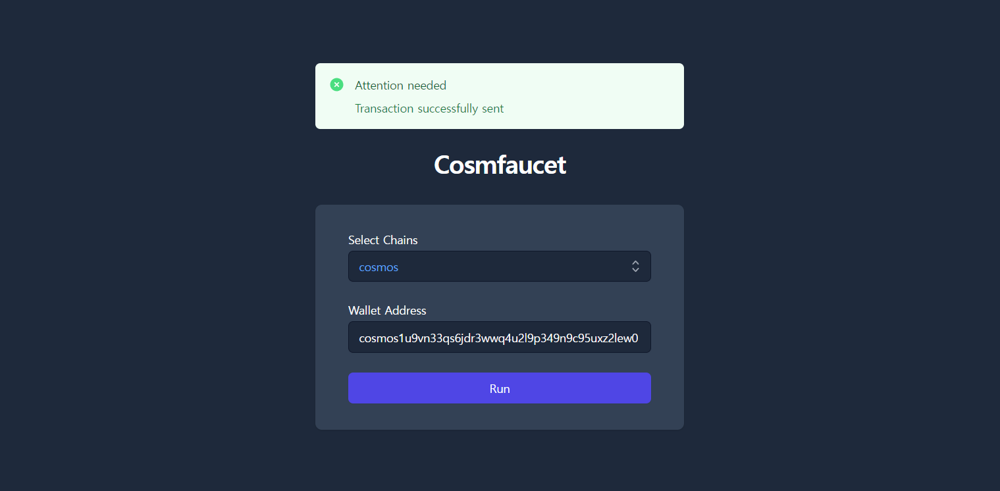

## Cosmfaucet

Cosmfaucet is a self-hosted faucet service for cosmos based blockchain.



#### Supported Features
* Multi-chain support

#### End-to-end Test Environment
Please check on `e2e/docker-compose.yml` file in this project.
It launches `a local testnet` and `the faucet server`.

#### Configuration
You can add supported chains as many as possible.

```yaml
# config.yml
server:
  allow_cors: false
  http:
    port: 8081
  grpc:
    port: 9092
  limit:
    enabled: true
    period: 86400
chains:
  - name: "cosmos"
    key_name: "cosmos"
    chain_id: "testchain"
    rpc_endpoint: "http://localhost:26657/"
    account_prefix: "cosmos"
    sender: "cosmos1u9vn33qs6jdr3wwq4u2l9p349n9c95uxz2lew0"
    key: "reopen throw concert garment wash slab jump company habit father below stage float attitude achieve net charge bulb mouse mind fat net hello vague"
    gas_adjustment: 1.2
    gas_price: "0.01uatom"
    drop_coin: "10000000uatom"
  - name: "osmosis"
    ...
```

| option | description                                                                                                                                                               | default |
| --- |---------------------------------------------------------------------------------------------------------------------------------------------------------------------------| --- |
| `server.allow_cors` | Allow CORS Policy                                                                                                                                                         | `false` |
| `server.http.port` | HTTP Server Port                                                                                                                                                          | `8081` |
| `server.grpc.port` | GRPC Server Port                                                                                                                                                          | `9092` |
| `server.limit.enabled` | Enable `the faucet limit` to prevent the fund from being drained from the single user                                                                                     | `true` |
| `server.limit.period` | The period of `the faucet limit` in seconds, any user cannot run the request more than once within this period                                                            | `86400` |
| `chains[].name` | The name of the chain                                                                                                                                                     |  |
| `chains[].key_name` | The name of the keyfile, the key is stored on `{name}.info` file in the `keys` folder                                                                                     |  |
| `chains[].chain_id` | The chain id of the chain, all chain ids must be unique for each other                                                                                                    |  |
| `chains[].rpc_endpoint` | The RPC endpoint of the chain, it must be accessible from the faucet server                                                                                               |  |
| `chains[].account_prefix` | The account prefix of the chain, it is used to check wether the given address is valid or not                                                                             |  |
| `chains[].sender` | The address of the sender                                                                                                                                                 |  |
| `chains[].key` | The private key of the sender, <br/>it is used to sign the transaction<br/>**Please do not use this key for important business, it must be only used for faucet service** |  |
| `chains[].gas_adjustment` | It's used to avoid underestimating amount of gas needed to send transaction                                                                                               | `1.2` |
| `chains[].gas_price` | The gas price of the chain                                                                           |  |
| `chains[].drop_coin` | The amount of the coin to be dropped, it must be in the format of `{amount}{denom}`                                                                                       |  |

